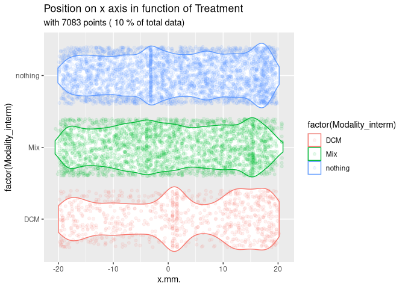
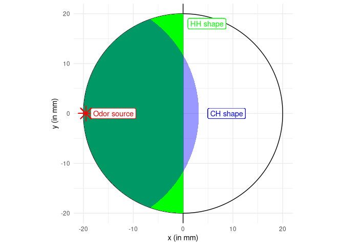

# MiteMapTools

MiteMapTools is a comprehensive R package for importing, analyzing, and
visualizing movement data from MiteMap tracking systems. MiteMap is a
cost-effective, open-source tool for 2D behavioral tracking of
arthropods, particularly useful for studying chemotactic responses and
movement patterns in controlled laboratory settings.

## About MiteMap

MiteMap is a Raspberry Pi-based automated tracking system designed to
monitor arthropod behavior in circular arenas. The system uses infrared
imaging to track individual organisms with high temporal resolution
(position recorded every 0.2 seconds) and spatial precision. This
technology enables researchers to study:

- **Chemotactic behavior**: How arthropods respond to attractive or
  repulsive volatile compounds
- **Movement patterns**: Analysis of trajectory complexity, speed, and
  spatial preferences  
- **Zone preferences**: Time allocation between different arena regions
- **Behavioral states**: Periods of activity vs. immobility

The system consists of a circular arena (typically 40mm diameter) where
test subjects are placed with potential stimuli positioned at the arena
periphery. High-resolution tracking data allows for detailed
quantitative analysis of behavioral responses.

## Scientific Background

This package implements methods described in:

**Masier, L.‐S., Roy, L., & Durand, J.‐F. (2022). A new methodology for
arthropod behavioral assays using MiteMap, a cost‐effective open‐source
tool for 2D tracking. Journal of Experimental Zoology Part A: Ecological
and Integrative Physiology, 337(4), 333-344.**
[doi:10.1002/jez.2651](https://onlinelibrary.wiley.com/doi/10.1002/jez.2651)

The original MiteMap hardware and software can be found at:
<https://github.com/LR69/MiteMap/tree/MiteMap.v6>

## Key Features

- **Data Import**: Seamlessly import MiteMap data from zip archives
  containing raw tracking files and metadata
- **Data Filtering**: Clean tracking data by removing artifacts,
  centering coordinates, and filtering by time/space constraints
- **Behavioral Analysis**: Calculate metrics like zone preferences,
  movement speeds, and immobility periods
- **Visualization**: Create publication-ready plots including trajectory
  maps, heatmaps, and statistical summaries
- **Statistical Testing**: Built-in functions for binomial tests of zone
  preferences with multiple comparison corrections
- **Multiple Data Formats**: Support for raw positional data and
  processed zone metrics (HH and CH formats)

## Data Formats

The Raw Tracking Data are comprised of: High-resolution positional data
with columns: - Time (seconds, recorded every 0.2s) - X coordinate
(mm)  
- Y coordinate (mm)

\[MiteMapTools::import_mitemap()\] computes summary metrics including
the presence in defined zones (HH and CH formats, see figure
@ref(fig:shape)):

### HH Format (Half-Half)

Arena divided by a line through the odor source, computing: - Time spent
in each half - Distance traveled in each zone - Immobility time in each
zone

### CH Format (Circle-Half)

Arena divided by a circle centered on the odor source, encompassing half
the arena surface: - Time spent inside/outside the circle - Movement
metrics for each zone - Behavioral preference indices

## Installation

You can install the development version of MiteMapTools from
[GitHub](https://github.com/) with:

``` r
# install.packages("pak")
pak::pak("adrientaudiere/MiteMapTools")
```

## Basic Usage

### Data Import and Filtering

This is a basic example showing how to filter and visualize MiteMap
data:

``` r
library(MiteMapTools)
#> Le chargement a nécessité le package : tidyverse
#> ── Attaching core tidyverse packages ──────────────────────── tidyverse 2.0.0 ──
#> ✔ dplyr     1.1.4     ✔ readr     2.1.5
#> ✔ forcats   1.0.0     ✔ stringr   1.5.2
#> ✔ ggplot2   4.0.0     ✔ tibble    3.3.0
#> ✔ lubridate 1.9.4     ✔ tidyr     1.3.1
#> ✔ purrr     1.1.0     
#> ── Conflicts ────────────────────────────────────────── tidyverse_conflicts() ──
#> ✖ dplyr::filter() masks stats::filter()
#> ✖ dplyr::lag()    masks stats::lag()
#> ℹ Use the conflicted package (<http://conflicted.r-lib.org/>) to force all conflicts to become errors
#> Le chargement a nécessité le package : readxl
#> 
#> Le chargement a nécessité le package : conflicted

# Import MiteMap from folders
MM <- import_mitemap(
  system.file("extdata", "mitemap_example", package = "MiteMapTools"),
  file_name_column = "File (mite ID)", verbose = FALSE, clean = TRUE
) 
# Create violin plots showing position distributions by experimental condition
vioplot_mitemap(MM, "Treatment", prop_points = 0.1)
```



### Data Structure Requirements

A MiteMap experiment folder should contain:

### Data Structure Requirements

A MiteMap experiment folder should contain:

**1. Zip archives** containing at least 2 files: - **Raw data CSV**:
3-columns tracking data - Time in seconds (recorded every 0.2s) - X
position (mm) - Y position (mm) - **PNG heatmap**: Visual representation
of movement patterns

**2. Metadata file** (Excel .xlsx or CSV format, optional) with 1
required column: - **File_name**: Must match the corresponding zip file
names. You can use other column name with the parameter
`file_name_column` in \[import_mitemap()\].

### Arena Layout and Zone Definitions

The following diagram illustrates how the arena is divided for HH and CH
zone computations:


