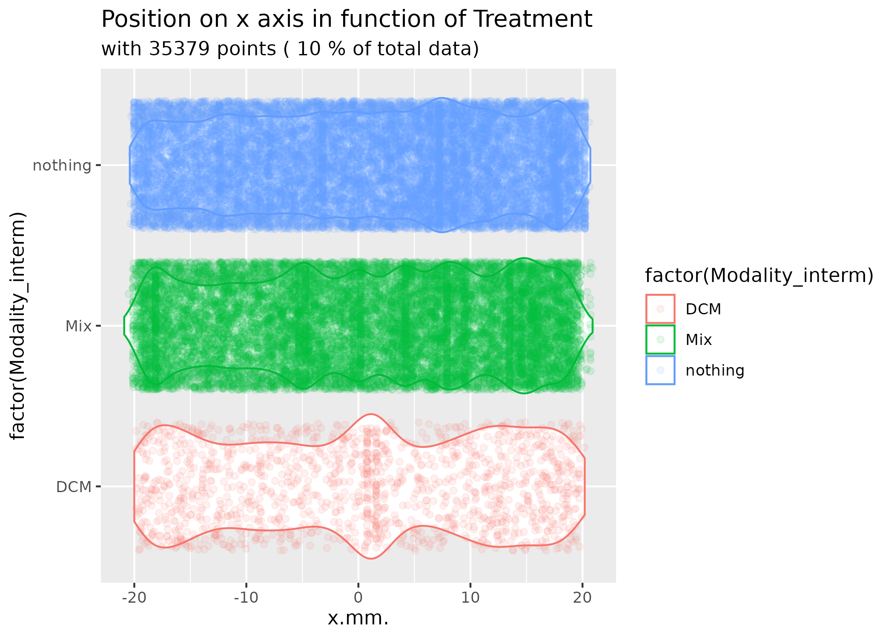
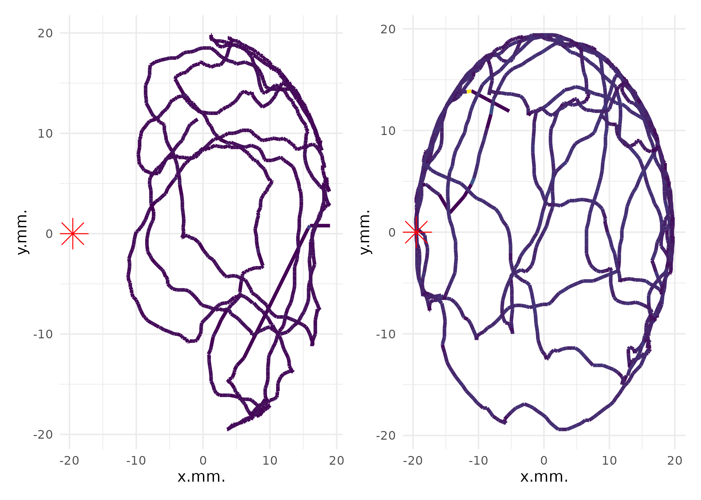
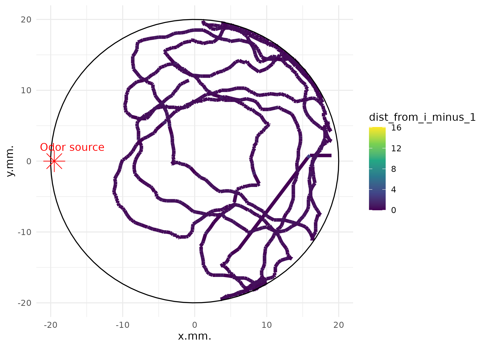
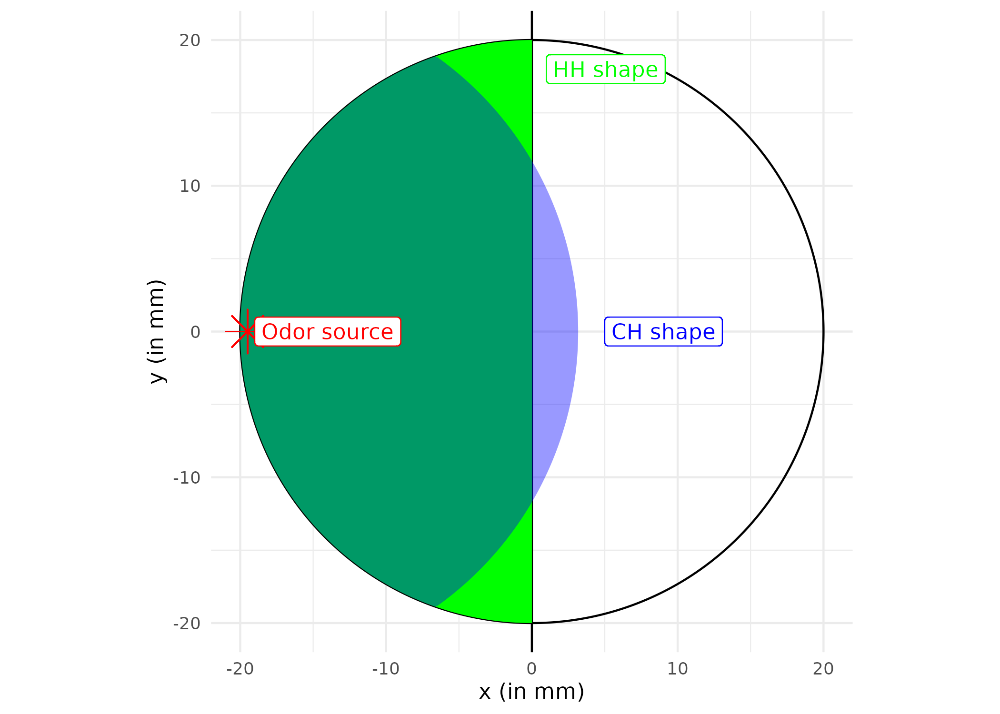
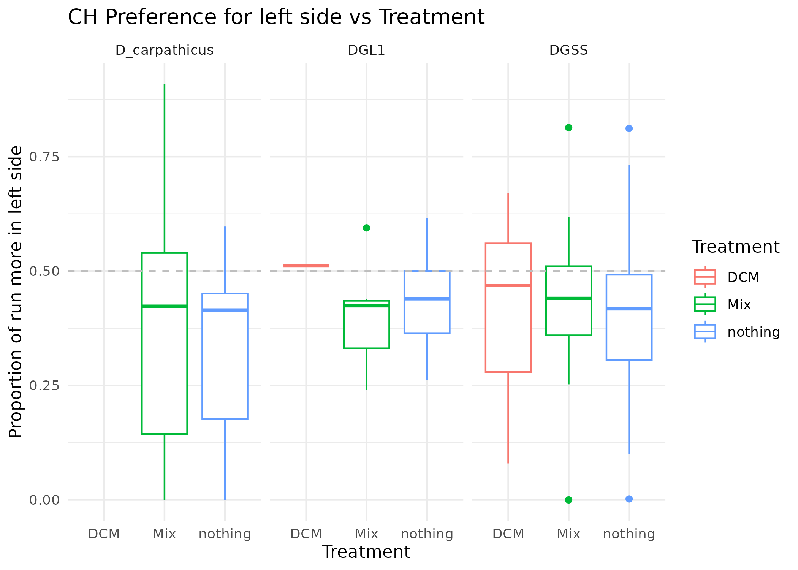
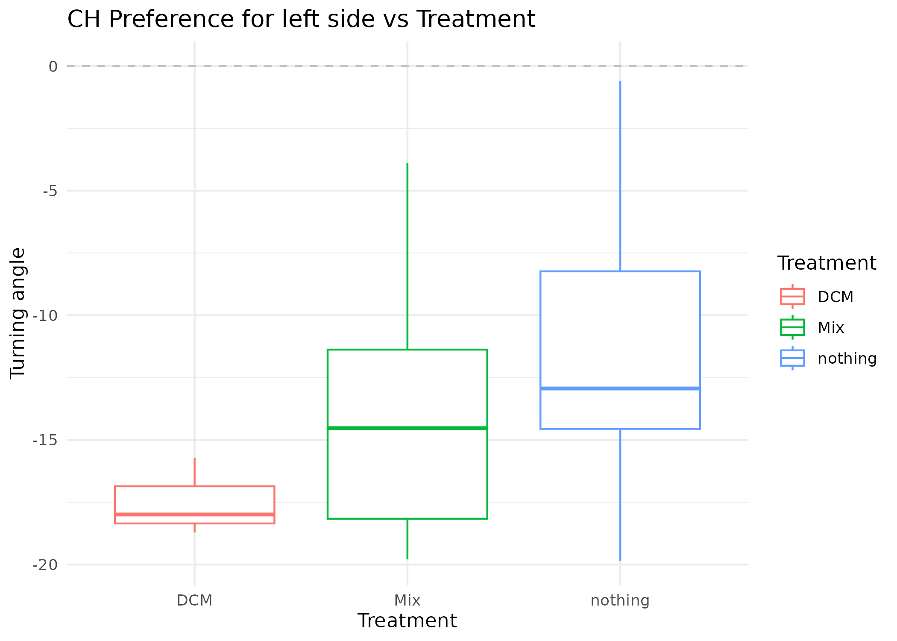
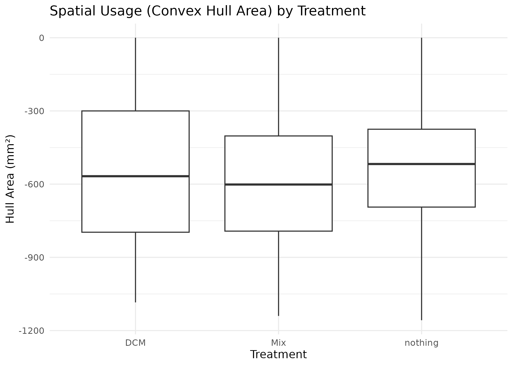
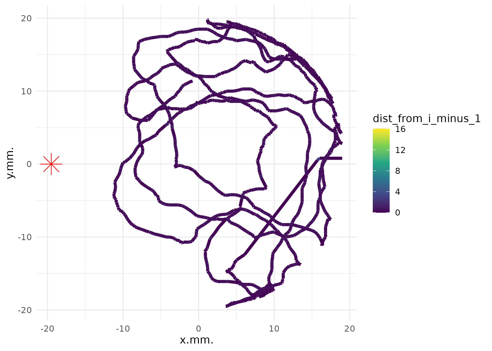
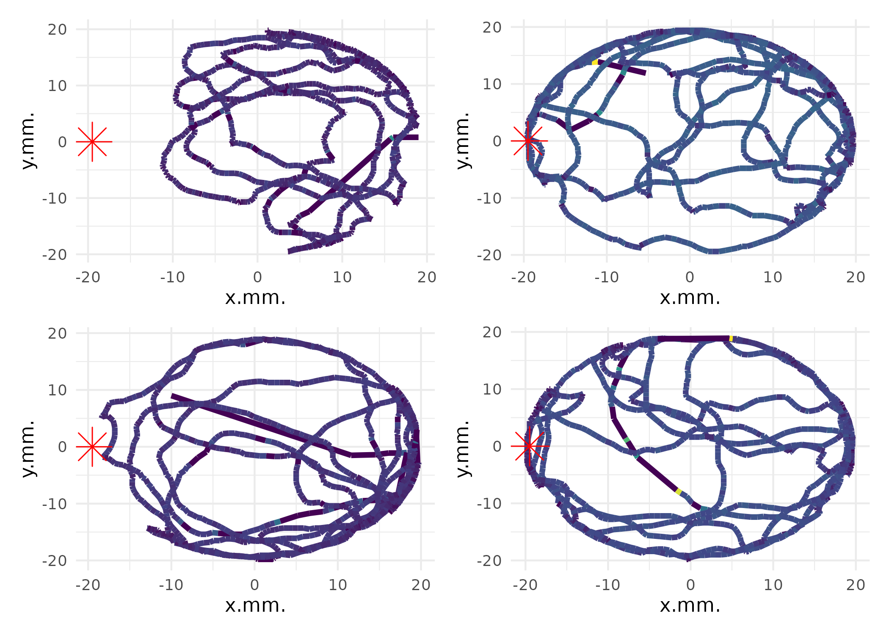

# Getting Started with MiteMapTools

## Introduction

MiteMapTools is a comprehensive R package for importing, analyzing, and
visualizing movement data from MiteMap tracking systems. MiteMap is a
cost-effective, open-source tool for 2D behavioral tracking of
arthropods, particularly useful for studying chemotactic responses and
movement patterns in controlled laboratory settings.

### About MiteMap

MiteMap is a Raspberry Pi-based automated tracking system designed to
monitor arthropod behavior in circular arenas. The system uses infrared
imaging to track individual organisms with high temporal resolution
(position recorded every 0.2 seconds) and spatial precision. This
technology enables researchers to study:

- **Chemotactic behavior**: How arthropods respond to attractive or
  repulsive volatile compounds
- **Movement patterns**: Analysis of trajectory complexity, speed, and
  spatial preferences  
- **Zone preferences**: Time allocation between different arena regions
- **Behavioral states**: Periods of activity vs. immobility

The system consists of a circular arena (typically 40mm diameter) where
test subjects are placed with potential stimuli positioned at the arena
periphery. High-resolution tracking data allows for detailed
quantitative analysis of behavioral responses. The original MiteMap
hardware and software can be found at:
<https://github.com/LR69/MiteMap/tree/MiteMap.v6>

### Scientific Background

This package implements methods described in:

**Masier, L.‐S., Roy, L., & Durand, J.‐F. (2022). A new methodology for
arthropod behavioral assays using MiteMap, a cost‐effective open‐source
tool for 2D tracking. Journal of Experimental Zoology Part A: Ecological
and Integrative Physiology, 337(4), 333-344.**
[doi:10.1002/jez.2651](https://onlinelibrary.wiley.com/doi/10.1002/jez.2651)

## Installation

You can install the development version of MiteMapTools from GitHub
with:

``` r
# install.packages("pak")
pak::pak("adrientaudiere/MiteMapTools")
```

## Basic Usage

Let’s start by loading the package and exploring the example dataset:

``` r
library(MiteMapTools)
#> Loading required package: tidyverse
#> ── Attaching core tidyverse packages ──────────────────────── tidyverse 2.0.0 ──
#> ✔ dplyr     1.1.4     ✔ readr     2.1.5
#> ✔ forcats   1.0.1     ✔ stringr   1.6.0
#> ✔ ggplot2   4.0.0     ✔ tibble    3.3.0
#> ✔ lubridate 1.9.4     ✔ tidyr     1.3.1
#> ✔ purrr     1.2.0     
#> ── Conflicts ────────────────────────────────────────── tidyverse_conflicts() ──
#> ✖ dplyr::filter() masks stats::filter()
#> ✖ dplyr::lag()    masks stats::lag()
#> ℹ Use the conflicted package (<http://conflicted.r-lib.org/>) to force all conflicts to become errors
#> Loading required package: readxl
#> 
#> Loading required package: conflicted
#> 
#> Loading required package: cli
```

### Data Import and Basic Visualization

The main function for importing MiteMap data is
[`import_mitemap()`](https://adrientaudiere.github.io/MiteMapTools/reference/import_mitemap.md).
For this tutorial, we’ll use both the built-in example dataset and
demonstrate how to import data from files.

#### Using Built-in Example Data

The package includes a pre-processed example dataset:

``` r
# Load the built-in example dataset
data(MM_data)

# Examine the structure of the data
head(MM_data)
#> # A tibble: 6 × 38
#> # Groups:   File_name [1]
#>   File_name X..t.s. x.mm. y.mm. Immobile..si..1. MiteID Well.Position Plate.name
#>   <chr>       <dbl> <dbl> <dbl>            <dbl> <chr>  <chr>         <chr>     
#> 1 MM012022…     2.2    19   0.8                1 SPT01… NA            ""        
#> 2 MM012022…     2.4    19   0.8                1 SPT01… NA            ""        
#> 3 MM012022…     2.6    19   0.8                1 SPT01… NA            ""        
#> 4 MM012022…     2.8    19   0.8                1 SPT01… NA            ""        
#> 5 MM012022…     3      19   0.8                1 SPT01… NA            ""        
#> 6 MM012022…     3.2    19   0.8                1 SPT01… NA            ""        
#> # ℹ 30 more variables: MiteID.1 <chr>, Run_no <chr>, Date <chr>, Hour <lgl>,
#> #   MM <int>, Pop. <chr>, Treatment <chr>, Duration <int>, run <chr>,
#> #   Biomol_sp <chr>, Haplotype <chr>, Morpho_sp <chr>, latitude <lgl>,
#> #   longitude <lgl>, site <chr>, notes <chr>, distance_from_previous <dbl>,
#> #   speed_mm_s <dbl>, is_immobile <lgl>, distance_from_sources <dbl>,
#> #   in_left_half_HH <lgl>, in_left_half_CH <lgl>,
#> #   turning_angle_clockwise <dbl>, turning_angle <dbl>, …

glimpse(MM_data)
#> Rows: 353,788
#> Columns: 38
#> Groups: File_name [251]
#> $ File_name                    <chr> "MM012022_05_17_08h23m05s", "MM012022_05_…
#> $ X..t.s.                      <dbl> 2.2, 2.4, 2.6, 2.8, 3.0, 3.2, 3.4, 3.6, 3…
#> $ x.mm.                        <dbl> 19.0, 19.0, 19.0, 19.0, 19.0, 19.0, 16.0,…
#> $ y.mm.                        <dbl> 0.8, 0.8, 0.8, 0.8, 0.8, 0.8, 0.8, 0.5, 0…
#> $ Immobile..si..1.             <dbl> 1, 1, 1, 1, 1, 1, 0, 0, 1, 1, 1, 1, 1, 1,…
#> $ MiteID                       <chr> "SPT01_6", "SPT01_6", "SPT01_6", "SPT01_6…
#> $ Well.Position                <chr> NA, NA, NA, NA, NA, NA, NA, NA, NA, NA, N…
#> $ Plate.name                   <chr> "", "", "", "", "", "", "", "", "", "", "…
#> $ MiteID.1                     <chr> "SPT01_6", "SPT01_6", "SPT01_6", "SPT01_6…
#> $ Run_no                       <chr> "1a", "1a", "1a", "1a", "1a", "1a", "1a",…
#> $ Date                         <chr> "11-mars", "11-mars", "11-mars", "11-mars…
#> $ Hour                         <lgl> NA, NA, NA, NA, NA, NA, NA, NA, NA, NA, N…
#> $ MM                           <int> 10, 10, 10, 10, 10, 10, 10, 10, 10, 10, 1…
#> $ Pop.                         <chr> "SPT", "SPT", "SPT", "SPT", "SPT", "SPT",…
#> $ Treatment                    <chr> "nothing", "nothing", "nothing", "nothing…
#> $ Duration                     <int> 5, 5, 5, 5, 5, 5, 5, 5, 5, 5, 5, 5, 5, 5,…
#> $ run                          <chr> "1er", "1er", "1er", "1er", "1er", "1er",…
#> $ Biomol_sp                    <chr> "DGSS", "DGSS", "DGSS", "DGSS", "DGSS", "…
#> $ Haplotype                    <chr> "", "", "", "", "", "", "", "", "", "", "…
#> $ Morpho_sp                    <chr> "", "", "", "", "", "", "", "", "", "", "…
#> $ latitude                     <lgl> NA, NA, NA, NA, NA, NA, NA, NA, NA, NA, N…
#> $ longitude                    <lgl> NA, NA, NA, NA, NA, NA, NA, NA, NA, NA, N…
#> $ site                         <chr> "SPT", "SPT", "SPT", "SPT", "SPT", "SPT",…
#> $ notes                        <chr> "", "", "", "", "", "", "", "", "", "", "…
#> $ distance_from_previous       <dbl> NA, 0.0000000, 0.0000000, 0.0000000, 0.00…
#> $ speed_mm_s                   <dbl> NA, 0.00000, 0.00000, 0.00000, 0.00000, 0…
#> $ is_immobile                  <lgl> NA, TRUE, TRUE, TRUE, TRUE, TRUE, FALSE, …
#> $ distance_from_sources        <dbl> 39.00820, 39.00820, 39.00820, 39.00820, 3…
#> $ in_left_half_HH              <lgl> FALSE, FALSE, FALSE, FALSE, FALSE, FALSE,…
#> $ in_left_half_CH              <lgl> FALSE, FALSE, FALSE, FALSE, FALSE, FALSE,…
#> $ turning_angle_clockwise      <dbl> NA, 0, 0, 0, 0, 0, 135, NA, 0, 0, 0, 0, 0…
#> $ turning_angle                <dbl> NA, -180, -180, -180, -180, -180, -45, NA…
#> $ turning_angle_odor_clockwise <dbl> NaN, NaN, NaN, NaN, NaN, 1.175133, 316.27…
#> $ turning_angle_odor           <dbl> NaN, NaN, NaN, NaN, NaN, -178.8249, 136.2…
#> $ turning_angle_ratio_odor     <dbl> NA, NA, NA, NA, NA, -1.175133, -181.27303…
#> $ crossings_at_point           <dbl> 0, 0, 0, 0, 0, 0, 0, 0, 0, 0, 0, 0, 0, 0,…
#> $ crossings_cumsum             <dbl> 0, 0, 0, 0, 0, 0, 0, 0, 0, 0, 0, 0, 0, 0,…
#> $ crossings_windowed           <dbl> 0, 0, 0, 0, 0, 0, 0, 0, 0, 0, 0, 0, 0, 0,…
```

#### Importing Data from Files

For your own data, you would import from MiteMap output files:

``` r
MM <- import_mitemap(
  system.file("extdata", "mitemap_example", package = "MiteMapTools"),
  file_name_column = "File (mite ID)",
  verbose = FALSE,
  clean = TRUE
)
```

For the rest of this tutorial, we’ll use the built-in `MM_data` dataset.

``` r
# Use the built-in data for examples
MM <- MM_data
```

### Creating Violin Plots

One of the key visualization functions is
[`vioplot_mitemap()`](https://adrientaudiere.github.io/MiteMapTools/reference/vioplot_mitemap.md),
which shows position distributions by experimental condition:

``` r
# Create violin plots showing position distributions by experimental condition
vioplot_mitemap(MM, "Treatment", prop_points = 0.1)
```



This plot shows how different treatments affect the distribution of
organism positions along the x-axis (with the odor source typically
positioned at x = -20mm and y = 0mm).

### Individual Trajectory Plotting

To visualize individual movement trajectories, use
[`plot_ind_mitemap()`](https://adrientaudiere.github.io/MiteMapTools/reference/plot_ind_mitemap.md):

``` r
# Plot individual trajectories for the first two organisms
library(patchwork) # for combining plots

# Get individual plots
p_list <- plot_ind_mitemap(MM, ind_index = c(1, 2))

# Combine plots side by side
p_list[[1]] + p_list[[2]] & theme(legend.position = "none")
```



You can also add arena context:

``` r
# Plot with arena circle and odor source
p_arena <- plot_ind_mitemap(
  MM,
  ind_index = 1,
  add_base_circle = TRUE,
  linewidth = 1.7,
  label_odor_source = "Odor source"
)

p_arena[[1]]
```



### Data Structure Requirements

For your own experiments, a MiteMap experiment folder should contain:

**1. Zip archives** containing at least 2 files: - **Raw data CSV**:
3-column tracking data (Time in seconds, X position in mm, Y position in
mm) - **PNG heatmap**: Visual representation of movement patterns

**2. Metadata file** (Excel .xlsx or CSV format, optional) with 1
required column: - **File_name**: Must match the corresponding zip file
names

You can use a different column name with the `file_name_column`
parameter in
[`import_mitemap()`](https://adrientaudiere.github.io/MiteMapTools/reference/import_mitemap.md).

### Arena Layout and Zone Definitions

The arena is divided into different zones for analysis:

#### HH Format (Half-Half)

- Arena divided by a line through the odor source
- Computes time spent in each half, distance traveled, and immobility
  time

#### CH Format (Circle-Half)

- Arena divided by a circle centered on the odor source
- Encompasses half the arena surface
- Analyzes time spent inside/outside the circle and behavioral
  preference indices



### Statistical Analysis

#### Summarise statistics at the run level

``` r
# Summarize statistics at the run level
MM_summary <- suppressWarnings(summarize_mitemap(MM))
glimpse(MM_summary)
#> Rows: 251
#> Columns: 106
#> $ File_name                         <chr> "MM012022_05_17_08h23m05s", "MM01202…
#> $ total_points                      <int> 1435, 1436, 1436, 1436, 1436, 1436, …
#> $ X..t.s._mean                      <dbl> 151.6256, 151.6254, 151.5908, 151.62…
#> $ X..t.s._sd                        <dbl> 86.41498, 86.38535, 86.39060, 86.435…
#> $ X..t.s._min                       <dbl> 2.2, 2.2, 2.1, 2.1, 2.1, 2.1, 2.1, 2…
#> $ X..t.s._max                       <dbl> 301.1, 301.1, 301.1, 301.2, 301.0, 3…
#> $ x.mm._mean                        <dbl> 6.5036237, 2.3161560, 5.9896240, 0.5…
#> $ x.mm._sd                          <dbl> 8.203713, 12.898348, 11.242192, 13.2…
#> $ x.mm._min                         <dbl> -11.2, -19.6, -18.4, -19.8, -20.6, -…
#> $ x.mm._max                         <dbl> 19.0, 19.7, 19.7, 19.7, 12.0, 19.5, …
#> $ y.mm._mean                        <dbl> 3.1159582, 4.6247911, -3.7378830, 0.…
#> $ y.mm._sd                          <dbl> 11.072074, 10.077295, 10.512801, 10.…
#> $ y.mm._min                         <dbl> -19.5, -19.4, -19.8, -19.8, -19.4, -…
#> $ y.mm._max                         <dbl> 19.8, 19.4, 19.1, 18.9, 19.5, 19.6, …
#> $ Immobile..si..1._mean             <dbl> 0.09477352, 0.02158774, 0.08217270, …
#> $ Immobile..si..1._sd               <dbl> 0.2930040, 0.1453837, 0.2747233, 0.2…
#> $ Immobile..si..1._min              <dbl> 0, 0, 0, 0, 0, 0, 0, 0, 0, 0, 0, 0, …
#> $ Immobile..si..1._max              <dbl> 1, 1, 1, 1, 1, 1, 1, 1, 1, 1, 1, 1, …
#> $ MM_mean                           <dbl> 10, 10, 10, 10, 10, 10, 10, 10, 10, …
#> $ MM_sd                             <dbl> 0, 0, 0, 0, 0, 0, 0, 0, 0, 0, 0, 0, …
#> $ MM_min                            <int> 10, 10, 10, 10, 10, 10, 10, 10, 10, …
#> $ MM_max                            <int> 10, 10, 10, 10, 10, 10, 10, 10, 10, …
#> $ Duration_mean                     <dbl> 5, 5, 5, 5, 5, 5, 5, 5, 5, 5, 5, 5, …
#> $ Duration_sd                       <dbl> 0, 0, 0, 0, 0, 0, 0, 0, 0, 0, 0, 0, …
#> $ Duration_min                      <int> 5, 5, 5, 5, 5, 5, 5, 5, 5, 5, 5, 5, …
#> $ Duration_max                      <int> 5, 5, 5, 5, 5, 5, 5, 5, 5, 5, 5, 5, …
#> $ distance_from_previous_mean       <dbl> 0.357855172, 0.561044253, 0.53285407…
#> $ distance_from_previous_sd         <dbl> 0.46575805, 0.28105464, 0.71827387, …
#> $ distance_from_previous_min        <dbl> 0, 0, 0, 0, 0, 0, 0, 0, 0, 0, 0, 0, …
#> $ distance_from_previous_max        <dbl> 16.0801119, 6.1351447, 24.0168691, 8…
#> $ speed_mm_s_mean                   <dbl> 1.74125463, 2.72796177, 2.56526737, …
#> $ speed_mm_s_sd                     <dbl> 2.3236597, 1.4092594, 2.7301272, 1.9…
#> $ speed_mm_s_min                    <dbl> 0, 0, 0, 0, 0, 0, 0, 0, 0, 0, 0, 0, …
#> $ speed_mm_s_max                    <dbl> 80.400560, 30.675723, 80.056230, 43.…
#> $ distance_from_sources_mean        <dbl> 28.96269, 25.55369, 28.74277, 23.991…
#> $ distance_from_sources_sd          <dbl> 7.9446311, 11.5859741, 10.0048046, 1…
#> $ distance_from_sources_min         <dbl> 9.2444578, 0.5099020, 2.4698178, 0.2…
#> $ distance_from_sources_max         <dbl> 39.12608, 39.72833, 39.82085, 39.718…
#> $ turning_angle_clockwise_mean      <dbl> 158.260914, 171.772328, 164.270352, …
#> $ turning_angle_clockwise_sd        <dbl> 67.67508, 47.01243, 59.58593, 54.303…
#> $ turning_angle_clockwise_min       <dbl> 0, 0, 0, 0, 0, 0, 0, 0, 0, 0, 0, 0, …
#> $ turning_angle_clockwise_max       <dbl> 352.8750, 360.0000, 355.2364, 355.60…
#> $ turning_angle_mean                <dbl> -21.739086, -8.227672, -15.729648, -…
#> $ turning_angle_sd                  <dbl> 67.67508, 47.01243, 59.58593, 54.303…
#> $ turning_angle_min                 <dbl> -180, -180, -180, -180, -180, -180, …
#> $ turning_angle_max                 <dbl> 172.8750, 180.0000, 175.2364, 175.60…
#> $ turning_angle_odor_clockwise_mean <dbl> 171.7055, 152.9723, 189.7393, 190.85…
#> $ turning_angle_odor_clockwise_sd   <dbl> 104.81931, 102.71052, 102.17589, 107…
#> $ turning_angle_odor_clockwise_min  <dbl> 2.652563e-01, 2.367581e-01, 5.932783…
#> $ turning_angle_odor_clockwise_max  <dbl> 359.6384, 359.9147, 359.8725, 359.89…
#> $ turning_angle_odor_mean           <dbl> -8.2944915, -27.0276516, 9.7393345, …
#> $ turning_angle_odor_sd             <dbl> 104.81931, 102.71052, 102.17589, 107…
#> $ turning_angle_odor_min            <dbl> -179.7347, -179.7632, -179.4067, -18…
#> $ turning_angle_odor_max            <dbl> 179.6384, 179.9147, 179.8725, 179.89…
#> $ turning_angle_ratio_odor_mean     <dbl> 0.6368880, 22.0315862, -14.0964193, …
#> $ turning_angle_ratio_odor_sd       <dbl> 115.3031, 111.7491, 111.5406, 116.62…
#> $ turning_angle_ratio_odor_min      <dbl> -357.0916, -347.0956, -359.4148, -34…
#> $ turning_angle_ratio_odor_max      <dbl> 337.3887, 307.0399, 329.1341, 338.23…
#> $ crossings_at_point_mean           <dbl> 0.16655052, 0.19777159, 0.21169916, …
#> $ crossings_at_point_sd             <dbl> 0.37827549, 0.40194030, 0.48935957, …
#> $ crossings_at_point_min            <dbl> 0, 0, 0, 0, 0, 0, 0, 0, 0, 0, 0, 0, …
#> $ crossings_at_point_max            <dbl> 2, 2, 5, 5, 4, 3, 3, 1, 3, 3, 3, 4, …
#> $ crossings_cumsum_mean             <dbl> 114.20279, 152.38719, 153.64485, 144…
#> $ crossings_cumsum_sd               <dbl> 68.662730, 86.369423, 98.218951, 89.…
#> $ crossings_cumsum_min              <dbl> 0, 0, 0, 0, 0, 0, 0, 0, 0, 0, 0, 0, …
#> $ crossings_cumsum_max              <dbl> 239, 284, 304, 271, 308, 277, 234, 1…
#> $ crossings_windowed_mean           <dbl> 0.16655052, 0.19777159, 0.21169916, …
#> $ crossings_windowed_sd             <dbl> 0.37827549, 0.40194030, 0.48935957, …
#> $ crossings_windowed_min            <dbl> 0, 0, 0, 0, 0, 0, 0, 0, 0, 0, 0, 0, …
#> $ crossings_windowed_max            <dbl> 2, 2, 5, 5, 4, 3, 3, 1, 3, 3, 3, 4, …
#> $ total_points_mean                 <dbl> 1435, 1436, 1436, 1436, 1436, 1436, …
#> $ total_points_sd                   <dbl> NA, NA, NA, NA, NA, NA, NA, NA, NA, …
#> $ total_points_min                  <int> 1435, 1436, 1436, 1436, 1436, 1436, …
#> $ total_points_max                  <int> 1435, 1436, 1436, 1436, 1436, 1436, …
#> $ MiteID                            <chr> "SPT01_6", "SPT01_12", "SPT01_18", "…
#> $ Well.Position                     <chr> NA, NA, NA, NA, NA, NA, NA, "B3", NA…
#> $ Plate.name                        <chr> "", "", "", "", "", "", "", "", "", …
#> $ MiteID.1                          <chr> "SPT01_6", "SPT01_12", "SPT01_18", "…
#> $ Run_no                            <chr> "1a", "2a", "3b", "2b", "1b", "4a", …
#> $ Date                              <chr> "11-mars", "11-mars", "11-mars", "11…
#> $ Pop.                              <chr> "SPT", "SPT", "SPT", "SPT", "SPT", "…
#> $ Treatment                         <chr> "nothing", "nothing", "DCM", "Mix", …
#> $ run                               <chr> "1er", "1er", "2e", "2e", "2e", "1er…
#> $ Biomol_sp                         <chr> "DGSS", "DGSS", "DGSS", "DGSS", "DGS…
#> $ Haplotype                         <chr> "", "", "", "", "", "", "", "", "", …
#> $ Morpho_sp                         <chr> "", "", "", "", "", "", "", "", "", …
#> $ site                              <chr> "SPT", "SPT", "SPT", "SPT", "SPT", "…
#> $ notes                             <chr> "", "", "", "", "", "", "", "", "", …
#> $ Hour_prop_TRUE                    <dbl> NaN, NaN, NaN, NaN, NaN, NaN, NaN, N…
#> $ Hour_nb_TRUE                      <int> 0, 0, 0, 0, 0, 0, 0, 0, 0, 0, 0, 0, …
#> $ Hour_nb_FALSE                     <int> 0, 0, 0, 0, 0, 0, 0, 0, 0, 0, 0, 0, …
#> $ latitude_prop_TRUE                <dbl> NaN, NaN, NaN, NaN, NaN, NaN, NaN, N…
#> $ latitude_nb_TRUE                  <int> 0, 0, 0, 0, 0, 0, 0, 0, 0, 0, 0, 0, …
#> $ latitude_nb_FALSE                 <int> 0, 0, 0, 0, 0, 0, 0, 0, 0, 0, 0, 0, …
#> $ longitude_prop_TRUE               <dbl> NaN, NaN, NaN, NaN, NaN, NaN, NaN, N…
#> $ longitude_nb_TRUE                 <int> 0, 0, 0, 0, 0, 0, 0, 0, 0, 0, 0, 0, …
#> $ longitude_nb_FALSE                <int> 0, 0, 0, 0, 0, 0, 0, 0, 0, 0, 0, 0, …
#> $ is_immobile_prop_TRUE             <dbl> 0.11436541, 0.03693380, 0.09407666, …
#> $ is_immobile_nb_TRUE               <int> 164, 53, 135, 90, 107, 106, 167, 425…
#> $ is_immobile_nb_FALSE              <int> 1270, 1382, 1300, 1345, 1328, 1329, …
#> $ in_left_half_HH_prop_TRUE         <dbl> 0.2411150, 0.4206128, 0.3119777, 0.4…
#> $ in_left_half_HH_nb_TRUE           <int> 346, 604, 448, 714, 1252, 656, 775, …
#> $ in_left_half_HH_nb_FALSE          <int> 1089, 832, 988, 722, 184, 780, 659, …
#> $ in_left_half_CH_prop_TRUE         <dbl> 0.24250871, 0.40181058, 0.27924791, …
#> $ in_left_half_CH_nb_TRUE           <int> 348, 577, 401, 660, 1168, 633, 678, …
#> $ in_left_half_CH_nb_FALSE          <int> 1087, 859, 1035, 776, 268, 803, 756,…
```

``` r
MM_summary |>
  filter(Biomol_sp %in% c("DGL1", "DGSS", "D_carpathicus")) |>
  ggplot(aes(x = Treatment, y = in_left_half_CH_prop_TRUE, col = Treatment)) +
  geom_boxplot() +
  geom_hline(yintercept = 0.5, linetype = "dashed", color = "grey") +
  theme_minimal() +
  labs(
    title = "CH Preference for left side vs Treatment",
    y = "Proportion of run more in left side",
    x = "Treatment"
  ) +
  facet_wrap(~Biomol_sp)
```



``` r
MM_summary |>
  filter(turning_angle_mean < 20 & turning_angle_mean > -20) |>
  ggplot(aes(x = Treatment, y = turning_angle_mean, col = Treatment)) +
  geom_boxplot() +
  geom_hline(yintercept = 0, linetype = "dashed", color = "grey") +
  theme_minimal() +
  labs(
    title = "CH Preference for left side vs Treatment",
    y = "Turning angle",
    x = "Treatment"
  )
```



#### Binomial Tests for Zone Preferences

Test whether organisms show significant preferences for specific zones:

``` r
# Test zone preferences by treatment
binom_results <- binom_test_mitemap(MM, factor = "Treatment")
#> ℹ Running binomial test with format: HH, level: run
#> Warning: There were 18 warnings in `summarise()`.
#> The first warning was:
#> ℹ In argument: `across(...)`.
#> ℹ In group 133: `File_name = "MM012022_05_17_20h27m19s"`.
#> Caused by warning in `min()`:
#> ! no non-missing arguments to min; returning Inf
#> ℹ Run `dplyr::last_dplyr_warnings()` to see the 17 remaining warnings.
#> ✔ Binomial test completed for 3 groups with BH adjustment
print(binom_results)
#> # A tibble: 3 × 8
#>   Treatment     n   yes    no p.value p.value.adj estimate CI           
#>   <chr>     <int> <int> <int>   <dbl>       <dbl>    <dbl> <chr>        
#> 1 DCM          10     5     5   1           1        0.5   0.187 - 0.813
#> 2 Mix         112    64    48   0.156       0.234    0.571 0.474 - 0.665
#> 3 nothing     129    79    50   0.013       0.039    0.612 0.523 - 0.697
```

#### Movement Metrics and Convex Hull Analysis

Calculate movement characteristics using convex hull analysis:

``` r
# Calculate convex hull metrics (spatial usage)
ch_results <- convex_hull_mitemap(MM, plot_show = FALSE, verbose = FALSE)
head(ch_results)
#>                                         File_name hull_area center_of_area_x
#> MM012022_05_17_08h23m05s MM012022_05_17_08h23m05s    -508.0        7.5821429
#> MM012022_05_17_08h23m17s MM012022_05_17_08h23m17s    -690.0        2.6984334
#> MM012022_05_17_08h23m39s MM012022_05_17_08h23m39s    -300.0        9.4900398
#> MM012022_05_17_08h23m53s MM012022_05_17_08h23m53s    -972.5        0.8603426
#> MM012022_05_17_08h35m31s MM012022_05_17_08h35m31s    -379.0      -11.2122492
#> MM012022_05_17_09h23m17s MM012022_05_17_09h23m17s   -1008.5        1.4514877
#>                          center_of_area_y center_of_mass_x center_of_mass_y
#> MM012022_05_17_08h23m05s         3.651190        6.6358268         3.872375
#> MM012022_05_17_08h23m17s         6.513055        1.8956522         5.979469
#> MM012022_05_17_08h23m39s        -6.511288        9.8550000        -7.737222
#> MM012022_05_17_08h23m53s         1.309618        0.6728363         1.817309
#> MM012022_05_17_08h35m31s         4.125660      -10.6451187         4.314864
#> MM012022_05_17_09h23m17s        -1.426908        1.4015865        -1.575773
#>                          hull_length
#> MM012022_05_17_08h23m05s    82.49809
#> MM012022_05_17_08h23m17s    98.12404
#> MM012022_05_17_08h23m39s    71.06560
#> MM012022_05_17_08h23m53s   113.96993
#> MM012022_05_17_08h35m31s    72.59859
#> MM012022_05_17_09h23m17s   114.80257

# Combine with metadata for analysis
library(dplyr)
combined_data <- full_join(ch_results, MM)
#> Joining with `by = join_by(File_name)`

# Visualize hull area by treatment
library(ggplot2)
combined_data %>%
  ggplot(aes(x = Treatment, y = hull_area)) +
  geom_boxplot() +
  theme_minimal() +
  labs(
    title = "Spatial Usage (Convex Hull Area) by Treatment",
    y = "Hull Area (mm²)"
  )
#> Warning: Removed 9995 rows containing non-finite outside the scale range
#> (`stat_boxplot()`).
```



### Data Filtering and Processing

The
[`filter_mitemap()`](https://adrientaudiere.github.io/MiteMapTools/reference/filter_mitemap.md)
function allows you to clean and process the tracking data. Note that
this is done automatically with clean=TRUE in
[`import_mitemap()`](https://adrientaudiere.github.io/MiteMapTools/reference/import_mitemap.md),
but you can

``` r
# Apply custom filtering
MM_filtered <- filter_mitemap(
  MM,
  first_seconds_to_delete = 10,
  max_x_value = 20,
  min_x_value = -20,
  max_y_value = 20,
  min_y_value = -20
)
#> 
#> ── Data filtering summary ──
#> 
#> ℹ Rows removed (first 10 seconds): 9267
#> ℹ Rows removed (bad x values): 2495
#> ℹ Rows removed (bad y values): 368
#> ✔ Total rows after filtering: 339936 (from 353788)
#> ✔ Total runs after filtering: 250 (from 251)

# Compare data sizes
cat("Original data points:", nrow(MM), "\n")
#> Original data points: 353788
cat("Filtered data points:", nrow(MM_filtered), "\n")
#> Filtered data points: 339936
```

### Advanced Visualizations

#### Movement Speed Analysis

Analyze movement speeds and create speed-colored trajectory plots:

``` r
# Create trajectory plots colored by movement speed
p_speed <- plot_ind_mitemap(
  MM,
  ind_index = 1:4,
  linewidth = 1.5
)

p_speed[[1]]
```



``` r

# Combine multiple speed plots
((p_speed[[1]] + p_speed[[2]]) / (p_speed[[3]] + p_speed[[4]])) +
  plot_layout(guides = "collect") & theme(legend.position = "none") &
  scale_color_viridis_c(name = "Speed\n(mm/s)", trans = "log1p")
#> Scale for colour is already present.
#> Adding another scale for colour, which will replace the existing scale.
#> Scale for colour is already present.
#> Adding another scale for colour, which will replace the existing scale.
#> Scale for colour is already present.
#> Adding another scale for colour, which will replace the existing scale.
#> Scale for colour is already present.
#> Adding another scale for colour, which will replace the existing scale.
```



## Summary

This vignette has introduced you to the basic functionality of
MiteMapTools:

1.  **Data Import**: Use
    [`import_mitemap()`](https://adrientaudiere.github.io/MiteMapTools/reference/import_mitemap.md)
    to load tracking data and metadata
2.  **Visualization**: Create violin plots with
    [`vioplot_mitemap()`](https://adrientaudiere.github.io/MiteMapTools/reference/vioplot_mitemap.md)
    and trajectory plots with
    [`plot_ind_mitemap()`](https://adrientaudiere.github.io/MiteMapTools/reference/plot_ind_mitemap.md)
3.  **Statistical Analysis**: Perform zone preference tests with
    [`binom_test_mitemap()`](https://adrientaudiere.github.io/MiteMapTools/reference/binom_test_mitemap.md)
4.  **Movement Analysis**: Calculate spatial metrics with
    [`convex_hull_mitemap()`](https://adrientaudiere.github.io/MiteMapTools/reference/convex_hull_mitemap.md)
5.  **Data Processing**: Filter and clean data with
    [`filter_mitemap()`](https://adrientaudiere.github.io/MiteMapTools/reference/filter_mitemap.md)

For more detailed information about specific functions, please refer to
their individual help pages using `?function_name` or browse the
[reference
documentation](https://adrientaudiere.github.io/MiteMapTools/reference/).

## Further Reading

- [Package
  Reference](https://adrientaudiere.github.io/MiteMapTools/reference/):
  Complete function documentation
- [Masier et
  al. (2022)](https://onlinelibrary.wiley.com/doi/10.1002/jez.2651):
  Original methodology paper
- [MiteMap Hardware](https://github.com/LR69/MiteMap/tree/MiteMap.v6):
  Hardware implementation details
